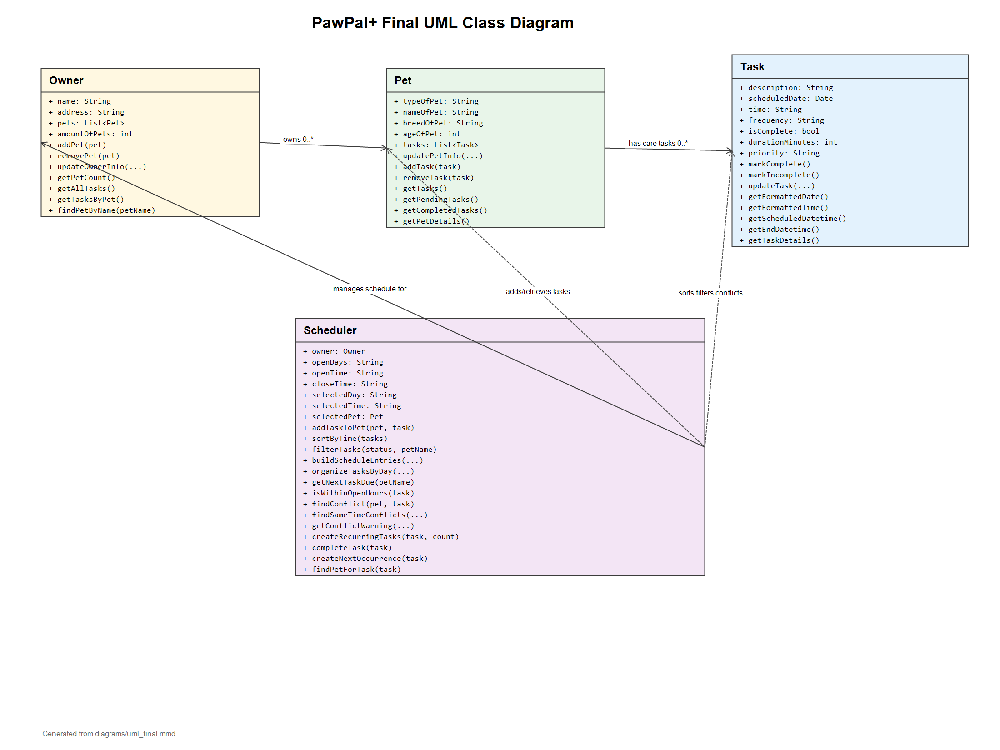

# PawPal+ (Module 2 Project)

You are building **PawPal+**, a Streamlit app that helps a pet owner plan care tasks for their pet.

## Scenario

A busy pet owner needs help staying consistent with pet care. They want an assistant that can:

- Track pet care tasks (walks, feeding, meds, enrichment, grooming, etc.)
- Consider constraints (time available, priority, owner preferences)
- Produce a daily plan and explain why it chose that plan

Your job is to design the system first (UML), then implement the logic in Python, then connect it to the Streamlit UI.

## What you will build

Your final app should:

- Let a user enter basic owner + pet info
- Let a user add/edit tasks (duration + priority at minimum)
- Generate a daily schedule/plan based on constraints and priorities
- Display the plan clearly (and ideally explain the reasoning)
- Include tests for the most important scheduling behaviors

## Features

- Sorting by time: `Scheduler.sort_by_time()` returns tasks in chronological order using each task's `time` value.
- Filtered task views: `Scheduler.filter_tasks()` can show all tasks, pending tasks, completed tasks, or tasks for one pet.
- Schedule grouping: `Scheduler.organize_tasks_by_day()` groups sorted tasks by date for an easier daily schedule view.
- Conflict warnings: `Scheduler.get_conflict_warning()` returns friendly warning messages when tasks overlap or share the same exact time.
- Duplicate-time detection: `Scheduler.find_same_time_conflicts()` checks whether one pet or multiple pets have tasks scheduled at the same date and time.
- Overlap detection: `Scheduler.find_conflict()` detects time-window overlaps for the same pet.
- Recurring tasks: `Scheduler.create_recurring_tasks()` and `Scheduler.add_recurring_tasks_to_pet()` generate repeated daily, weekly, every-two-weeks, or monthly tasks.
- Daily and weekly completion recurrence: `Scheduler.complete_task()` creates the next pending daily or weekly task after the current one is marked complete.
- Pet-specific suggestions: `Scheduler.get_task_suggestions()` suggests care tasks based on whether the pet is a dog, cat, or other animal.
- Professional Streamlit displays: `app.py` uses `st.table`, `st.success`, `st.warning`, and `st.info` to present sorted schedules, filters, and conflict feedback clearly.

## Getting started

### Setup

```bash
python -m venv .venv
source .venv/bin/activate  # Windows: .venv\Scripts\activate
pip install -r requirements.txt
```

### Suggested workflow

1. Read the scenario carefully and identify requirements and edge cases.
2. Draft a UML diagram (classes, attributes, methods, relationships).
3. Convert UML into Python class stubs (no logic yet).
4. Implement scheduling logic in small increments.
5. Add tests to verify key behaviors.
6. Connect your logic to the Streamlit UI in `app.py`.
7. Refine UML so it matches what you actually built.

## Final UML Diagram

The final Mermaid source is saved at `diagrams/uml_final.mmd`.



## Sample Output

See the **Demo Walkthrough** section below for the full terminal output from
`python main.py`, including sorted tasks, filtered task views, and a conflict
warning example.

## Testing PawPal+

Run the full test suite with:

```bash
python -m pytest
```

The tests cover the core PawPal+ logic, including task formatting, task
completion, owner and pet task tracking, chronological sorting, filtering by pet
or completion status, conflict detection, recurring task creation, automatic
daily/weekly rescheduling, and warning messages for duplicate times.

Successful test run:

```text
============================= test session starts =============================
platform win32 -- Python 3.12.10, pytest-9.1.1, pluggy-1.6.0
rootdir: C:\Users\nuela\OneDrive - purdue.edu\CodingPath\AI_Classes\AI_101\ai110-module2show-pawpal-starter
plugins: anyio-4.14.1
collected 24 items

tests\test_pawpal.py ........................                            [100%]

============================= 24 passed in 0.05s ==============================
```

Confidence Level: 5/5 stars

Because all 24 tests pass and the tests cover sorting, filtering, recurrence,
conflict detection, and warning behavior, I am highly confident in the current
logic layer.

## 📐 Smarter Scheduling

PawPal+ includes several lightweight scheduling algorithms in `pawpal_system.py`
to make the app more useful for a pet owner.

| Feature | Method(s) | What it does |
|---------|-----------|--------------|
| Sorting behavior | `Scheduler.sort_by_time()`, `Scheduler.build_schedule_entries()` | Sorts `Task` objects by their `time` value. `build_schedule_entries()` also sorts schedule entries by date/time, priority, pet name, and task description for a stable daily plan. |
| Filtering behavior | `Scheduler.filter_tasks()`, `Scheduler.get_pending_tasks()`, `Scheduler.get_completed_tasks()` | Filters tasks by completion status, pet name, or both. For example, it can return only pending tasks for one pet. |
| Conflict detection logic | `Scheduler.find_conflict()`, `Scheduler.find_same_time_conflicts()`, `Scheduler.get_conflict_warning()`, `Scheduler.add_task_to_pet()` | Detects overlapping tasks for the same pet and exact same-time conflicts across one or more pets. The warning method returns a friendly message instead of crashing the app. |
| Recurring task logic | `Scheduler.create_recurring_tasks()`, `Scheduler.add_recurring_tasks_to_pet()`, `Scheduler.complete_task()`, `Scheduler.create_next_occurrence()` | Creates repeated task copies for daily, weekly, every-two-weeks, and monthly schedules. When a daily or weekly task is completed, the scheduler can automatically create the next pending occurrence. |

## Demo Walkthrough

PawPal+ lets a pet owner manage care tasks through a Streamlit interface. A user can:

1. Enter owner information such as name and address.
2. Add one or more pets with type, breed, and age.
3. Choose a pet and schedule a care task using suggested task names or a custom description.
4. Set the task date, time, duration, priority, frequency, and number of recurring occurrences.
5. See conflict warnings before a duplicate or overlapping task is scheduled.
6. Mark pending tasks complete from the task management section.
7. Generate a schedule that is sorted, grouped by day, and filterable by pet or completion status.

Example workflow:

1. Add an owner named `Nuela`.
2. Add `Buddy` as a dog and `Milo` as a cat.
3. Schedule tasks such as `Morning walk`, `Breakfast`, `Grooming`, and `Clean litter box`.
4. Generate the schedule to view tasks sorted chronologically.
5. Try adding another task at `08:00` for Buddy to see the scheduler return a conflict warning.

Key Scheduler behaviors shown:

- `Scheduler.sort_by_time()` displays tasks from earliest to latest.
- `Scheduler.filter_tasks()` separates pending, completed, and pet-specific task lists.
- `Scheduler.get_conflict_warning()` returns a safe warning message instead of crashing.
- `Scheduler.find_same_time_conflicts()` detects duplicate task times.
- `Scheduler.complete_task()` supports daily and weekly recurrence when tasks are completed.

Sample CLI output from `python main.py`:

```text
PawPal Terminal Demo for Nuela

All Tasks Sorted By Time
========================
07:30 - Breakfast (pending)
08:00 - Morning walk (pending)
11:30 - Clean litter box (complete)
14:00 - Grooming (complete)
18:00 - Dinner (pending)

Pending Tasks Only
==================
07:30 - Breakfast (pending)
08:00 - Morning walk (pending)
18:00 - Dinner (pending)

Completed Tasks Only
====================
11:30 - Clean litter box (complete)
14:00 - Grooming (complete)

Buddy's Tasks
=============
08:00 - Morning walk (pending)
14:00 - Grooming (complete)
18:00 - Dinner (pending)

Milo's Pending Tasks
====================
07:30 - Breakfast (pending)

Conflict Warning Demo
=====================
Warning: Buddy already has 'Morning walk' scheduled near 08:00.
```
